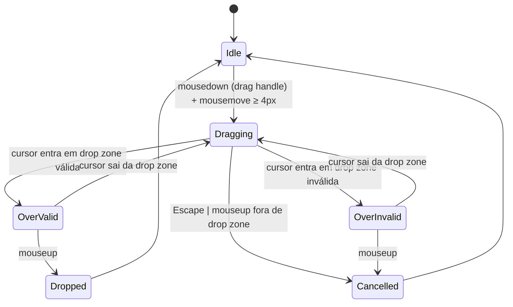

# UX Spec — Projetos e Pastas

Feature: organização hierárquica de mockups em projetos e pastas.
Escopo: sidebar tree, drag-and-drop, seção Recentes, empty states, breadcrumbs.
Fase: G0 — fluxos e critérios de aceite. Estética a cargo do UI Designer.

---

## Arquitetura de Informação

```
Raiz da aplicação (/mockups)
└── Projeto Alpha                        ← container de nível 1
    ├── [Recentes]                        ← seção virtual, só na raiz do projeto
    │   ├── Mockup X (link)
    │   └── Mockup Y (link)
    ├── Pasta Landing                     ← container de nível 2
    │   ├── Subpasta Hero                 ← nível 3 (máx. 5 níveis)
    │   │   └── Mockup 1
    │   └── Mockup 2
    └── Mockup 3                          ← mockup solto (sem pasta)
└── Projeto Beta
    └── …
```

**Regras estruturais:**
- Profundidade máxima de aninhamento: **5 níveis** (Projeto → Pasta 1 → … → Pasta 4 → Mockup).
- Uma pasta pode conter pastas filhas e/ou mockups diretamente; os dois tipos coexistem.
- Mockups existem em exatamente um local (não há aliases/atalhos na G0).
- A seção "Recentes" é virtual — não é uma pasta real, não aparece em breadcrumbs, nunca dentro de pasta.

---

## User Stories

| ID | Como… | Quero… | Para… |
|----|-------|--------|-------|
| US-01 | usuário | expandir/colapsar pastas na sidebar com um clique ou teclado | navegar pela hierarquia sem perder contexto |
| US-02 | usuário | arrastar um mockup ou pasta para outro local | reorganizar sem precisar de menus contextuais |
| US-03 | usuário | ver meus mockups mais recentes no topo da sidebar | abrir rapidamente o que usei por último |
| US-04 | usuário | criar uma pasta a partir de um estado vazio | começar a organizar um projeto novo |
| US-05 | usuário | criar o primeiro mockup a partir de um estado vazio | não ficar preso numa tela em branco |
| US-06 | usuário | ver o caminho completo do mockup atual em breadcrumbs clicáveis | voltar a qualquer nível sem usar o botão Voltar |
| US-07 | usuário | navegar pela sidebar inteiramente com teclado | trabalhar sem depender do mouse |
| US-08 | usuário com low-vision | receber feedback auditivo de cada ação de drag-and-drop | confirmar que a operação ocorreu corretamente |

---

## Fluxo 1 — Sidebar Tree: Expand / Collapse

### Trigger
Usuário clica no chevron de uma pasta **ou** pressiona `ArrowRight` com a pasta focada.

### Estado: Colapsada (idle)
- Pasta exibe chevron `▶` (rotação 0°).
- Filhos não renderizados no DOM (ou `display: none` — a definir pelo UI Designer).
- `aria-expanded="false"` no elemento da pasta.

### Fluxo Primário (expandir via mouse)
1. Usuário clica no chevron ou no label da pasta.
2. **Feedback imediato (< 120 ms):** chevron rotaciona 90° (`▶` → `▼`), filhos deslizam para baixo via `--motion-base / --ease-spring`.
3. `aria-expanded="true"`.
4. Estado final: pasta expandida, filhos visíveis.

### Fluxo Secundário (colapsar)
1. Usuário clica no chevron de uma pasta já expandida.
2. Chevron rotaciona de volta (90° → 0°), filhos colapsam.
3. Se o item atualmente selecionado estiver dentro da pasta colapsada, o foco e a seleção **não mudam** — o item continua ativo mesmo invisível.

### Navegação por Teclado (foco em um item da tree)
| Tecla | Ação |
|-------|------|
| `ArrowRight` | Se pasta colapsada: expande. Se pasta expandida ou mockup: move foco para primeiro filho. |
| `ArrowLeft` | Se pasta expandida: colapsa. Se pasta colapsada ou mockup: move foco para o item pai. |
| `ArrowDown` | Move foco para o próximo item visível (ordem de leitura DOM). |
| `ArrowUp` | Move foco para o item visível anterior. |
| `Enter` / `Space` | Ativa o item: abre o mockup ou toggle expand da pasta. |
| `Home` | Move foco para o primeiro item da tree. |
| `End` | Move foco para o último item visível da tree. |
| `Escape` | Colapsa a pasta focada (se expandida) ou move o foco para o pai. |
| `Tab` | Sai da sidebar tree para o próximo landmark da página. |

### Edge Cases
- **Pasta vazia expandida:** exibe empty state inline (ver Fluxo 4).
- **Pasta com 50+ itens:** a lista é virtualizável (implementação a cargo do desenvolvedor). O spec garante que keyboard nav funcione sem limite de scroll manual.
- **Nomes longos (> 24 ch na sidebar):** truncados com `text-overflow: ellipsis`. Tooltip `title` no elemento exibe o nome completo. Isso não é responsabilidade do UX Spec definir o limiar — o UI Designer decide o breakpoint.
- **Animação desabilitada:** `prefers-reduced-motion: reduce` → chevron muda de estado instantaneamente, sem transição de deslizamento.

---

## Fluxo 2 — Drag-and-Drop

### Estados do Sistema



### Affordances por Estado

| Estado | Cursor | Ghost Preview | Drop Indicator | Item Original |
|--------|--------|---------------|----------------|---------------|
| `Idle` | `default` | — | — | normal |
| `Dragging` | `grabbing` | clone semitransparente (~60% opacity) que segue o ponteiro | — | opacity reduzida (~40%) |
| `OverValid` | `grabbing` | clone semitransparente | linha horizontal de inserção (antes/depois de um item) **ou** borda de destaque em pasta-alvo | opacity reduzida |
| `OverInvalid` | `not-allowed` | clone semitransparente com ícone ⛔ | — | sem mudança |
| `Dropped` | `default` | desaparece com fade-out 80ms | desaparece | item aparece no novo local com fade-in 120ms |
| `Cancelled` | `default` | retorna via animação de estorno (`--ease-spring`, 180ms) ao ponto de origem | — | volta a opacity normal |

### Zonas Válidas vs. Inválidas

**Válidas:**
- Entre dois itens na mesma lista (reordenação).
- Sobre uma pasta fechada (mover para dentro dela; expansão automática após 600 ms de hover).
- Na área vazia abaixo da lista de uma pasta expandida (adicionar ao final).
- Na raiz do projeto (soltar o item fora de qualquer pasta).

**Inválidas:**
- Sobre o próprio item sendo arrastado.
- Sobre um descendente da pasta sendo arrastada (evitar ciclo).
- Sobre a seção "Recentes" (ela é somente leitura).
- Além do nível de aninhamento máximo (5).

### Expansão Automática de Pastas Fechadas
Ao manter o ghost sobre uma pasta fechada por **600 ms**, a pasta expande automaticamente para revelar filhos como drop targets. Se o usuário sair antes de 600 ms, a pasta não expande.

### Reordenação vs. Movimento
- Drop **entre** itens (indicador de linha) = reordenação na lista atual.
- Drop **sobre** uma pasta = movimento para dentro dela (como último filho).

### Comportamento < 768px (Mobile/Tablet)
Drag-and-drop nativo desativado em viewports < 768px. O usuário reorganiza via menu contextual ("Mover para…") que abre um modal de seleção de destino (long-press ou botão de opções `⋮`).

### Acessibilidade — Drag-and-Drop via Teclado
Todo item arrastável deve ser operável via teclado como alternativa ao mouse:

1. Foco no item → pressionar `Space` → **modo seleção de movimento ativado**.
2. `ArrowUp` / `ArrowDown` movem o item na lista (feedback: live region anuncia posição atual).
3. `Enter` confirma a nova posição. `Escape` cancela e retorna ao local original.
4. O drag handle deve ter `role="button"` e `aria-label="Arrastar [nome do item]"`.
5. `aria-live="assertive"` anuncia: "Mockup X movido para Pasta Y, posição 3 de 7" após drop.

---

## Fluxo 3 — Seção "Recentes"

### Regras de exibição
- Aparece **apenas** na raiz de um projeto (nível imediatamente abaixo do nó do projeto).
- **Nunca** dentro de uma pasta, independentemente de onde o usuário navegou.
- Exibe os **últimos 5 mockups acessados** neste projeto (ordem: mais recente primeiro).
- "Acessado" = qualquer abertura do viewer do mockup (`/mockups/[id]`).
- Se o usuário nunca abriu nenhum mockup neste projeto: seção "Recentes" **não é exibida**.
- Se houver menos de 2 mockups acessados: exibir apenas os disponíveis (sem itens fictícios de preenchimento).

### Comportamento
- Cada item de "Recentes" é um link direto para o mockup — clicar abre o viewer.
- Itens de "Recentes" são somente leitura: não há drag handle, não aparecem como drop targets.
- A seção não aparece em resultados de busca como container.
- `aria-label="Recentes"` no elemento de seção. `role="region"`.

### Keyboard Nav
- A seção "Recentes" participa do `ArrowDown`/`ArrowUp` da tree como se fosse uma pasta sempre expandida.
- `Enter` em um item de "Recentes" navega para o mockup.
- Não há `ArrowRight`/`ArrowLeft` (não expansível).

---

## Fluxo 4 — Empty States

### 4a. Projeto sem nenhum mockup e sem pastas

**Trigger:** usuário acessa a raiz de um projeto onde não há mockups nem pastas criados.

**Conteúdo do empty state:**
- Ícone ilustrativo (definido pelo UI Designer).
- Título: "Nenhum mockup ainda".
- Subtítulo: "Crie uma pasta para organizar ou faça upload do primeiro mockup.".
- CTA primário: "Fazer upload de mockup" → dispara o modal de upload existente.
- CTA secundário: "Criar pasta" → dispara o flow de criação de pasta inline (ver Fluxo 4c).

**Localização:** no corpo principal da página (não na sidebar). A sidebar exibe apenas o nó do projeto vazio.

### 4b. Pasta vazia (sem filhos)

**Trigger:** usuário expande uma pasta que não contém nenhum mockup nem subpasta.

**Conteúdo inline (dentro da sidebar, logo abaixo do header da pasta):**
- Texto: "Pasta vazia".
- CTA inline: "+ Adicionar mockup" → abre modal de upload com a pasta pré-selecionada como destino.

**Conteúdo na área principal (quando a pasta está "aberta"/ativa como contexto):**
- Mesmo padrão do 4a, com CTA "Fazer upload de mockup" e "Criar subpasta".

### 4c. Criação de pasta inline (na sidebar)

**Trigger:** CTA "Criar pasta" de qualquer empty state, ou ação de menu contextual na sidebar.

**Flow:**
1. Na sidebar, um campo de texto inline aparece no local de inserção (mesmo nível do trigger).
2. Placeholder: "Nome da pasta".
3. `Enter` → confirma criação. `Escape` → cancela sem criar.
4. Nome vazio ao pressionar `Enter` → foco permanece no campo, sem criação.
5. Nome com mais de 255 caracteres → truncado silenciosamente para 255 (ou mostrar contador — a definir pelo UI Designer).
6. Nome duplicado no mesmo nível → mensagem de erro inline: "Já existe uma pasta com esse nome aqui."

---

## Fluxo 5 — Breadcrumbs

### Formato
```
Projeto Alpha / Pasta Landing / Subpasta Hero / Mockup 1
```

- Separador: `/` (barra, com espaços).
- Cada segmento é clicável exceto o segmento final (contexto atual), que é texto simples.
- `aria-label="Navegação estrutural"` no `<nav>`. Implementar como `<ol>` com `<li>` para cada segmento. Item atual com `aria-current="page"`.

### Truncação
- Se o caminho completo exceder o espaço disponível, os segmentos do meio são substituídos por `…` (ellipsis interativo).
- Clicar em `…` expande o breadcrumb completo (inline, sem modal).
- O primeiro segmento (Projeto) e o último (página atual) nunca são truncados.
- Mínimo visível: `Projeto / … / Mockup atual`.

### Localização
- No topo da área principal, abaixo do AppNav, acima do conteúdo da página.
- Não aparece na sidebar.
- Na raiz do projeto (sem pasta selecionada): breadcrumb exibe apenas `Projeto Alpha`.

### Navegação via Breadcrumb
- Click em `Projeto Alpha` → vai para `/mockups` com o projeto expandido na sidebar.
- Click em `Pasta Landing` → vai para a view daquela pasta.
- Não há breadcrumb na página `/mockups` (raiz da app) — só em contextos dentro de um projeto.

### Keyboard
- Tab alcança o breadcrumb como um todo.
- Dentro do breadcrumb: `ArrowLeft`/`ArrowRight` entre segmentos clicáveis.
- `Enter` em um segmento navega.

---

## Fluxo 6 — Comportamento Responsivo (< 768px)

### Sidebar Colapsável
- Por padrão, a sidebar fica oculta (traduzida para fora da viewport).
- Um botão de menu hambúrguer (☰) no header abre a sidebar como drawer lateral.
- O drawer é um `<dialog>` com `role="dialog"`, `aria-modal="true"`, e focus trap ativo.
- Fechar: botão "✕" no topo do drawer, click fora do drawer, ou `Escape`.
- O foco retorna ao botão hambúrguer ao fechar.

### Drag-and-Drop em Mobile
- Substituído por menu contextual de "Mover para…" (ver Fluxo 2 — Comportamento < 768px).

### Breadcrumbs em Mobile
- Truncação agressiva: exibe apenas o segmento atual e `…` com link para o nível superior.
- Tapping `…` expande o breadcrumb completo como um dropdown temporário.

---

## Critérios de Aceite (Gherkin)

### Sidebar — Expand/Collapse

```gherkin
Feature: Sidebar Tree Expand/Collapse

  Scenario: Expandir pasta com mouse
    Given existe um projeto com uma pasta chamada "Landing"
    And a pasta está colapsada
    When o usuário clica no chevron da pasta "Landing"
    Then a pasta expande em ≤ 120ms
    And o chevron rotaciona de 0° para 90°
    And os filhos da pasta ficam visíveis
    And aria-expanded na pasta é "true"

  Scenario: Colapsar pasta com mouse
    Given a pasta "Landing" está expandida
    When o usuário clica no chevron da pasta "Landing"
    Then a pasta colapsa
    And o chevron rotaciona de 90° para 0°
    And aria-expanded na pasta é "false"

  Scenario: Expandir pasta com ArrowRight
    Given a pasta "Landing" está focada e colapsada
    When o usuário pressiona ArrowRight
    Then a pasta expande
    And o foco permanece na pasta "Landing"

  Scenario: Mover foco para filho com ArrowRight em pasta expandida
    Given a pasta "Landing" está focada e expandida
    When o usuário pressiona ArrowRight
    Then o foco move para o primeiro filho da pasta

  Scenario: Colapsar pasta com ArrowLeft
    Given a pasta "Landing" está focada e expandida
    When o usuário pressiona ArrowLeft
    Then a pasta colapsa
    And o foco permanece na pasta "Landing"

  Scenario: Mover foco para pai com ArrowLeft em item não-expandível
    Given o "Mockup 1" (filho da pasta "Landing") está focado
    When o usuário pressiona ArrowLeft
    Then o foco move para a pasta "Landing"

  Scenario: Pasta com 50+ itens — navegação sem travamento
    Given existe uma pasta com 52 mockups filhos
    When o usuário expande a pasta e navega com ArrowDown
    Then o foco avança item por item sem congelamento visível
    And todos os itens são alcançáveis via teclado
```

### Drag-and-Drop

```gherkin
Feature: Drag-and-Drop de Mockups e Pastas

  Scenario: Mover mockup para outra pasta
    Given o "Mockup A" está na pasta "Landing"
    And a pasta "Pricing" existe e está visível
    When o usuário arrasta "Mockup A" e solta sobre a pasta "Pricing"
    Then "Mockup A" aparece como filho de "Pricing"
    And "Mockup A" desaparece de "Landing"
    And uma live region anuncia "Mockup A movido para Pricing"

  Scenario: Cancelar drag com Escape
    Given o usuário iniciou o drag de "Mockup A"
    When o usuário pressiona Escape
    Then o ghost preview retorna ao ponto de origem com animação
    And "Mockup A" permanece em sua posição original
    And uma live region anuncia "Movimento cancelado"

  Scenario: Tentar mover pasta para dentro de si mesma
    Given o usuário arrasta a pasta "Landing"
    When o cursor entra sobre a pasta "Landing" ou um descendente dela
    Then o cursor muda para not-allowed
    And não há drop indicator
    And soltar o mouse não move a pasta

  Scenario: Tentar exceder profundidade máxima
    Given existe aninhamento com 5 níveis de pastas
    When o usuário tenta arrastar uma pasta para o 5º nível
    Then o estado OverInvalid é ativado no alvo
    And ao soltar, nenhuma ação ocorre

  Scenario: Expansão automática de pasta fechada durante drag
    Given o usuário está arrastando "Mockup A"
    And a pasta "Pricing" está fechada
    When o cursor permanece sobre "Pricing" por 600ms
    Then "Pricing" expande automaticamente
    And os filhos de "Pricing" ficam disponíveis como drop targets

  Scenario: Drag via teclado
    Given o "Mockup A" está focado na sidebar
    When o usuário pressiona Space para iniciar o modo de movimento
    And pressiona ArrowDown duas vezes
    And pressiona Enter para confirmar
    Then "Mockup A" é reposicionado duas posições abaixo
    And uma live region anuncia a nova posição

  Scenario: Drag em viewport < 768px
    Given o viewport tem 390px de largura
    When o usuário tenta iniciar um drag em "Mockup A"
    Then o drag nativo não inicia
    And ao long-press ou clicar no botão ⋮, o menu contextual "Mover para…" aparece
```

### Seção Recentes

```gherkin
Feature: Seção Recentes

  Scenario: Exibição na raiz do projeto com histórico
    Given o usuário acessou "Mockup X" e "Mockup Y" neste projeto
    When o usuário visualiza a raiz do projeto na sidebar
    Then a seção "Recentes" aparece no topo da árvore do projeto
    And lista "Mockup X" (mais recente) e "Mockup Y"

  Scenario: Sem histórico — seção não exibida
    Given o usuário nunca abriu nenhum mockup neste projeto
    When o usuário visualiza a raiz do projeto na sidebar
    Then a seção "Recentes" não aparece

  Scenario: Recentes não aparece dentro de pasta
    Given o usuário navega até a pasta "Landing"
    When o usuário visualiza a sidebar dentro do contexto da pasta "Landing"
    Then a seção "Recentes" não aparece

  Scenario: Recentes é somente leitura
    Given a seção "Recentes" está visível
    When o usuário tenta iniciar um drag em um item de "Recentes"
    Then o drag não inicia
    And nenhum drag handle é exibido no item
```

### Empty States

```gherkin
Feature: Empty States

  Scenario: Projeto vazio — CTAs presentes
    Given existe um projeto sem mockups e sem pastas
    When o usuário acessa a raiz do projeto
    Then a área principal exibe o empty state com:
      | elemento               | valor                                        |
      | Título                 | "Nenhum mockup ainda"                        |
      | CTA primário           | "Fazer upload de mockup"                     |
      | CTA secundário         | "Criar pasta"                                |
    And clicar em "Fazer upload de mockup" abre o modal de upload

  Scenario: Pasta vazia — empty state inline na sidebar
    Given existe uma pasta "Pricing" sem filhos
    When o usuário expande "Pricing" na sidebar
    Then abaixo do header "Pricing" aparece o texto "Pasta vazia"
    And aparece um link "+ Adicionar mockup"

  Scenario: Criar pasta com nome duplicado
    Given a pasta "Landing" já existe no mesmo nível
    When o usuário tenta criar outra pasta chamada "Landing" inline
    Then uma mensagem de erro aparece: "Já existe uma pasta com esse nome aqui."
    And a pasta não é criada
    And o campo de texto mantém o foco

  Scenario: Criar pasta com nome vazio
    Given o campo de criação de pasta está ativo
    When o usuário pressiona Enter com o campo vazio
    Then nenhuma pasta é criada
    And o foco permanece no campo

  Scenario: Cancelar criação de pasta
    Given o campo de criação de pasta está ativo
    When o usuário pressiona Escape
    Then o campo desaparece sem criar pasta
```

### Breadcrumbs

```gherkin
Feature: Breadcrumbs

  Scenario: Breadcrumb completo para mockup aninhado
    Given o usuário está no "Mockup 1" dentro de "Subpasta Hero" dentro de "Landing" dentro de "Projeto Alpha"
    When o usuário visualiza o breadcrumb
    Then o breadcrumb exibe: "Projeto Alpha / Landing / Subpasta Hero / Mockup 1"
    And "Mockup 1" não é clicável (aria-current="page")
    And os demais segmentos são links

  Scenario: Navegar para pasta via breadcrumb
    Given o breadcrumb exibe "Projeto Alpha / Landing / Subpasta Hero / Mockup 1"
    When o usuário clica em "Landing"
    Then a navegação vai para a view de "Landing"
    And a sidebar destaca "Landing" como item ativo

  Scenario: Truncação de breadcrumb longo
    Given o caminho tem 5 segmentos e o espaço é insuficiente
    When o usuário visualiza o breadcrumb
    Then os segmentos do meio são substituídos por "…"
    And "Projeto Alpha" e o segmento final sempre ficam visíveis
    And clicar em "…" expande o breadcrumb completo inline

  Scenario: Breadcrumb na raiz do projeto
    Given o usuário está na raiz de "Projeto Alpha" (sem pasta selecionada)
    When o usuário visualiza o breadcrumb
    Then o breadcrumb exibe apenas "Projeto Alpha"
    And não há segmentos clicáveis (é a página atual)
```

### Responsivo

```gherkin
Feature: Sidebar Colapsável em Mobile

  Scenario: Sidebar oculta por padrão em mobile
    Given o viewport tem 390px de largura
    When a página carrega
    Then a sidebar não está visível
    And um botão hambúrguer ☰ aparece no header

  Scenario: Abrir sidebar em mobile
    Given o viewport tem 390px de largura
    When o usuário clica no botão ☰
    Then a sidebar abre como drawer lateral
    And o foco move para o primeiro item focável dentro do drawer
    And existe um focus trap dentro do drawer

  Scenario: Fechar drawer com Escape
    Given o drawer da sidebar está aberto em mobile
    When o usuário pressiona Escape
    Then o drawer fecha
    And o foco retorna ao botão ☰
```

---

## Requisitos de Acessibilidade (WCAG 2.1 AA)

### Semântica e ARIA

| Elemento | Role / Atributos obrigatórios |
|----------|-------------------------------|
| Sidebar tree (container) | `role="tree"` |
| Item de pasta | `role="treeitem"`, `aria-expanded="true/false"`, `aria-level="{1..5}"`, `aria-setsize="{n}"`, `aria-posinset="{i}"` |
| Item de mockup (folha) | `role="treeitem"`, `aria-level="{n}"`, `aria-setsize="{n}"`, `aria-posinset="{i}"` |
| Drag handle | `role="button"`, `aria-label="Arrastar [nome do item]"`, `aria-grabbed="true/false"` |
| Seção Recentes | `role="region"`, `aria-label="Recentes"` |
| Breadcrumb | `<nav aria-label="Navegação estrutural">`, `<ol>`, item atual com `aria-current="page"` |
| Drawer mobile | `role="dialog"`, `aria-modal="true"`, `aria-label="Menu de navegação"` |
| Live region (D&D) | `aria-live="assertive"`, `aria-atomic="true"` |

### Contraste

- Todo texto sobre superfície deve atender WCAG AA: ≥ 4.5:1 (texto normal), ≥ 3:1 (texto grande ≥ 18px ou bold ≥ 14px).
- Drop indicators e bordas de destaque ativo: ≥ 3:1 vs. fundo adjacente.
- Os tokens existentes (`--text`, `--text-bright`, `--accent`, `--border-strong`) já atendem esse requisito no tema escuro — o UI Designer não deve introduzir variações sem verificar.

### Focus Management

- Focus ring global via `--focus-ring` cobre todos os itens interativos.
- Ao abrir o drawer mobile: foco vai para o primeiro item focável dentro do drawer (botão ✕ ou primeiro item da tree).
- Ao fechar o drawer: foco retorna ao botão ☰.
- Ao confirmar drop via teclado: foco permanece no item movido em sua nova posição.
- Ao cancelar drag via `Escape`: foco retorna ao drag handle do item.
- Ao criar pasta inline: foco vai para o campo de texto. Ao confirmar/cancelar: foco vai para o item recém-criado ou para o item que ativou o campo.

### Reduced Motion

- Todas as animações (chevron, slide-down de filhos, ghost preview, fade de drop) respeitam `prefers-reduced-motion: reduce` — ficam instantâneas ou são omitidas.
- A live region ainda anuncia ações mesmo sem animação.

### Outros

- Todos os ícones decorativos têm `aria-hidden="true"`.
- Ícones que substituem texto têm `aria-label` no elemento-pai ou `<title>` inline (SVG).
- Não usar `tabindex > 0`. Ordem de tab segue a ordem natural do DOM.

---

## Métricas de Sucesso

| Métrica | Target |
|---------|--------|
| Tempo para mover um mockup de pasta via drag | ≤ 5s (p75 em session recording) |
| Tempo para mover um mockup de pasta via teclado | ≤ 8s (p75) |
| Taxa de conclusão de criação de pasta | ≥ 85% (usuários que iniciaram o flow) |
| Erro de drop inválido sem feedback adequado | 0 ocorrências reportadas em QA |
| Cobertura de teclado (todos os itens alcançáveis sem mouse) | 100% (auditoria manual) |
| Falha de contraste (WCAG AA) reportada em auditoria | 0 |
| Usuários que abriram o drawer mobile e não conseguiram fechar | < 2% |

---

## Restrições

1. **Tokens apenas existentes** — não introduzir novas variáveis CSS. Usar o vocabulário de `src/styles/tokens.css`.
2. **Sem decisões estéticas** — este spec define fluxos, estados e interações. Cores exatas, tamanhos de fonte, ícones e ilustrações são responsabilidade do UI Designer.
3. **Sem código** — nenhum componente é implementado aqui. O spec é a fonte de verdade para o UI Designer e o Engenheiro.
4. **Schema pendente** — os modelos `Project` e `Folder` não existem no Prisma. O Engenheiro deve criar a migração antes da implementação. Este spec não define colunas — apenas o comportamento observável.
